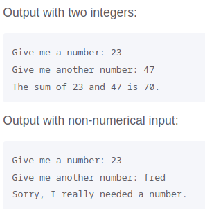

## Python: Try-Except Practice

### Overview

In this project, you'll learn how to use the `try-except` block to catch and handle exceptions that might pop up when you run your code.

A `try-except` block can help keep your script from crashing when the user enters incorrect or unexpected input.

### Coding

- Complete the practice scripts below
- Use comments to label each script in your `main.py` file

#### Doing Addition
One common problem when prompting users to enter numbers occurs when people input text instead of numbers. When you try to convert the input to an **integer**, you'll get a `ValueError`.

- Write a script that prompts the user to enter two **integers**
- In your `except` clause, catch the `TypeError`, and print a friendly error message that tells the user you were expecting a number
- Also add an `else` clause to your script underneath your `except` clause
- In your `else` clause, find the sum of the two integers and use an f-string to print and display the sum of the two numbers
- Test your script first by entering two numbers and then by entering some text instead of a number  

#### Invalid List Element

- Start by creating an empty Python list named `my_scores`
- In your `try` block:
  - prompt the user to enter an **integer** to add to your empty list
  - Tell Python to treat the user's input as an integer
  - Use the `append()` method to add the user's input to the list
  - Print the updated list
- As part of your `except` block:
  - catch a `ValueError` and then print a message that says:
    - *Invalid input! Please enter a valid integer!*
   
#### Invalid Index

- Start by creating a list named `my_nums` and filling it with the numbers 10, 20, 30, 40, 50 and 60
- In your `try` block:
  - prompt the user to enter an **integer** between 0 and 5 (since the list contains six items)
  - use an f-string to print the item at the index the user enters
- As part of your first `except` block, catch an `IndexError` and print the message: *Index out of range! Enter an index between 0 and 5 only!*
- As part of your second `except` block, catch a `ValueError` and print the message: *Invalid input! Enter an integer only!*
